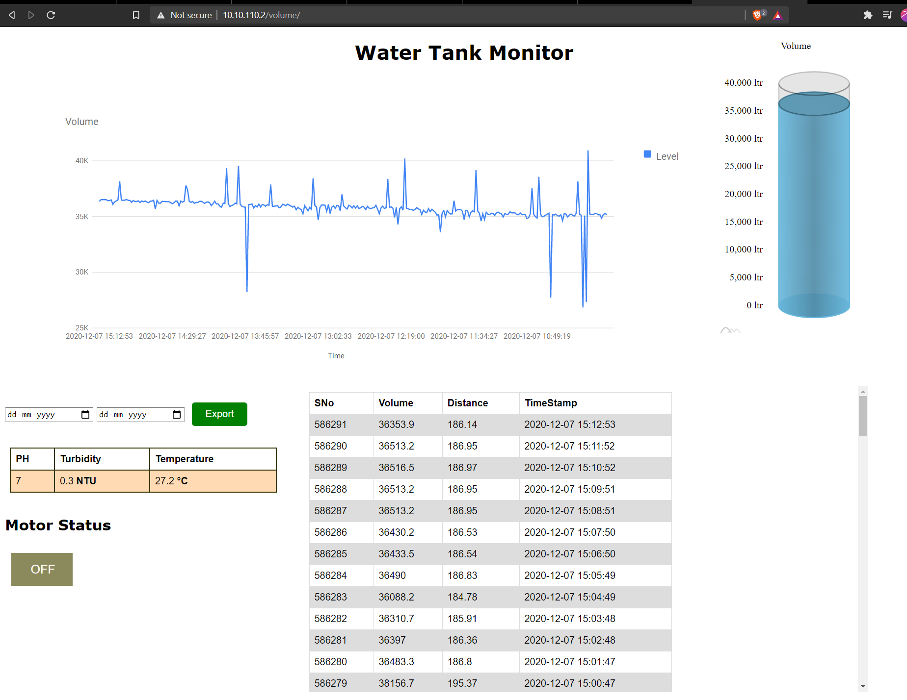

# Water Tank Data Monitoring and Analysis using IoT

# Hardware Used
* ESP8266
* Ultranic Sensor (HC-SR04)
* Turbidity Sensor (TS-300B)
* Liquid PH Sensor

# Working
* Distance between water surface and sensor is detected.
* Using the distance and water tank dimensions volume is calculated
* Grapg is plotted using the data.
* Water Turbidity is detected with TS-300B turbidity sensor.
* Water acidity level and Temperature is detected with Analogue PH Sensor.

# Data Webpage
  
  
